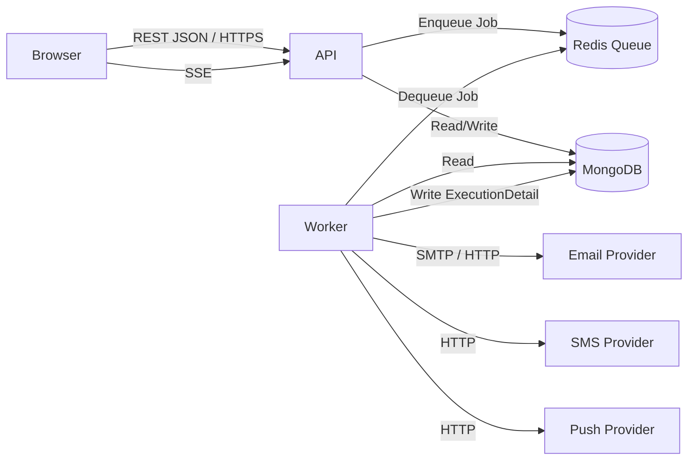

# ARCHITECTURE.md — Campus Notification Engine

> All decisions are grounded in verified Stage 0–8 findings. Where the original used a pattern
> we are keeping, the source observation is noted. Where we diverge, the reason is stated.

---

## 1. Component Map

| Component | Role | Tech |
|-----------|------|------|
| **API Server** | HTTP REST API; auth, routing, rate-limiting | NestJS (TypeScript) |
| **Worker** | Dequeues jobs; renders step content; dispatches to providers | NestJS (TypeScript) |
| **Dashboard** | Admin SPA for managing workflows, subscribers, and integrations | React + Vite (TypeScript) |
| **MongoDB** | Primary document store for all business entities | MongoDB 6+ |
| **Redis** | Job queue (BullMQ) and pub/sub for real-time updates | Redis 7+ |
| **External Providers** | Email (e.g., SendGrid), SMS (e.g., Twilio), Push | HTTP/SMTP (per provider SDK) |

> We omit ClickHouse (analytics). We omit the dedicated WebSocket (`apps/ws`) process; real-time
> in-app updates are delivered via a lightweight SSE endpoint on the API Server.

---

## 2. Architecture Diagram



---

## 3. Request Flow (Happy Path — Trigger Notification)

```
Browser / LMS  →  POST /v1/events/trigger  →  API Server
API Server     →  Validate auth & payload   →  Enqueue Job to Redis
Redis          →  Worker picks up Job
Worker         →  Fetch Workflow + Subscriber from MongoDB
Worker         →  Render step template with payload
Worker         →  Call Email Provider (SMTP/HTTP)
Worker         →  Write ExecutionDetail to MongoDB
```

---

## 4. External Services

| Service | Purpose | Owned by us? |
|---------|---------|--------------|
| Email provider (e.g., SendGrid) | Delivers email messages | No — 3rd party |
| SMS provider (e.g., Twilio) | Delivers SMS messages | No — 3rd party |
| Push provider (e.g., FCM) | Delivers push notifications | No — 3rd party |
| Redis | Queue + pub/sub | Yes — self-hosted |
| MongoDB | Document store | Yes — self-hosted |

---

## 5. Where State Lives

| State | Location | Notes |
|-------|----------|-------|
| User accounts, organisations, environments | MongoDB | Primary source of truth |
| Workflows (NotificationTemplate), steps | MongoDB | Steps are embedded sub-documents |
| Step control values (template content) | MongoDB — `ControlValues` collection | Separate collection; must be atomic with workflow |
| Subscriber records | MongoDB | Soft-deletable; unique per Environment |
| Delivered messages | MongoDB — `Message` collection | Append-only after delivery; indexed for inbox reads |
| Job queue | Redis (BullMQ) | Ephemeral; jobs are re-created from MongoDB on replay |
| Auth sessions / API key lookup | MongoDB (`Environment.apiKeys`) | Hash stored; raw key never stored |
| Feature flags | In-process env variable (`process.env`) | No external flag service in this rebuild |

---

## 6. Key Architectural Decisions

### Decision 1 — Atomic Workflow + Control Values via MongoDB Session

**Problem (observed in original):** `NotificationTemplate` insert and `ControlValues` insert are two sequential operations without a wrapping MongoDB multi-document transaction. A failure between them leaves orphaned data.
(Evidence: `libs/application-generic/src/usecases/upsert-workflow/upsert-workflow.usecase.ts:102-110` [Confirmed])

**Our decision:** Wrap both operations in a single MongoDB Client Session using `session.withTransaction()`. The session is opened at the controller (or use-case entry) level and passed into all repository calls.

**Trade-off:** Requires MongoDB replica set (not standalone). Acceptable because campus deployments will use a 3-node replica set for data durability anyway.

---

### Decision 2 — Hard 409 on Duplicate Subscriber (not raw 500)

**Problem (observed in original):** Duplicate subscriber creation during concurrent requests throws a MongoDB E11000 unique-index violation that bubbles up as a raw 500 Internal Server Error.
(Evidence: `libs/dal/src/repositories/subscriber/subscriber.schema.ts:175` [Confirmed])

**Our decision:** Catch `MongoServerError` with `code === 11000` in the subscriber repository and rethrow as a typed `ConflictException('SUBSCRIBER_ALREADY_EXISTS')`, which NestJS maps to 409 with a structured body.

---

### Decision 3 — No Soft-Delete on Message; Use TTL Index Instead

**Problem (observed in original):** Four Mongoose `pre` query hooks filter soft-deleted messages at runtime, preventing index usage and carrying explicit TODO comments for removal (task `nv-5688`).
(Evidence: `libs/dal/src/repositories/message/message.schema.ts:177-191` [Confirmed])

**Our decision:** Messages are never soft-deleted. Old messages are expired via a MongoDB TTL index on `createdAt` (configurable, default 90 days). Inbox deletion is modelled as `archived: true` with a compound query filter, not a soft-delete flag.

---

### Decision 4 — Validate Step `_id` Ownership Server-Side

**Problem (observed in original):** When matching incoming step updates to existing steps, the server trusts the client-supplied `_id` without verifying it belongs to the current workflow.
(Evidence: `libs/application-generic/src/usecases/upsert-workflow/upsert-workflow.usecase.ts:639` [Confirmed])

**Our decision:** Before matching, load all step IDs for the target workflow from MongoDB and reject any incoming `_id` not present in that set with a 400 `STEP_NOT_IN_WORKFLOW` error.

---

### Decision 5 — Single-Process API (no separate WS app)

**Rationale:** The original's `apps/ws` is a separate NestJS process that bridges Redis pub/sub to WebSocket. For the hackathon scope, we replace this with SSE (Server-Sent Events) emitted from the API Server over a `/v1/sse` endpoint. This eliminates one process to operate.

---

### Decision 6 — Environment Backward-Compat Hook Removed

**Problem (observed in original):** A `post` Mongoose hook mutates all returned Environment documents to inject a `type` field for documents created before the field existed.
(Evidence: `libs/dal/src/repositories/environment/environment.schema.ts:108` [Confirmed])

**Our decision:** All environments in our system are created fresh; the `type` field is required at schema level with no hook fallback.
