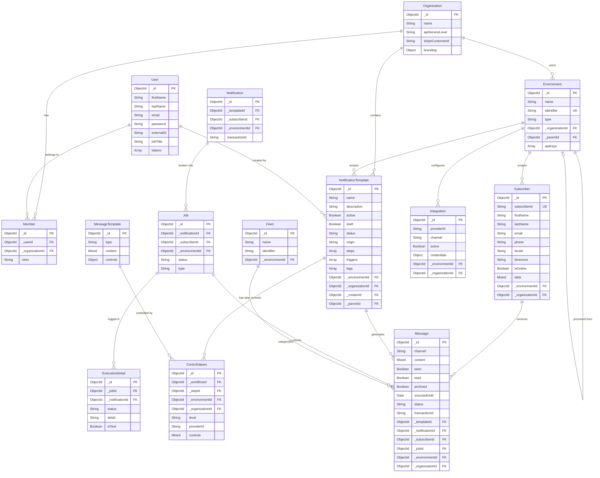

# DATA_MODEL.md — Campus Notification Engine

> Every entity here is derived from verified Stage 0–8 schema observations.
> Field names and types match the original; relationship storage mechanism is noted per relation.
> Anything marked Unknown was not confirmed during reverse-engineering.

---

## 1. erDiagram

---

## 2. Entity Reference

### User

| Field | Type | Constraint | Notes |
|-------|------|-----------|-------|
| `_id` | ObjectId | PK | Auto-generated |
| `firstName` | String | — | |
| `lastName` | String | — | |
| `email` | String | Unique (self-hosted only) | Not unique on cloud |
| `password` | String | — | Bcrypt hash |
| `externalId` | String | — | Clerk / external auth id |
| `tokens` | Array | — | OAuth provider tokens (embedded) |
| `jobTitle` | String | — | |

**Indexes:** `{ email: 1 }` unique — applied conditionally when `IS_SELF_HOSTED=true`.

---

### Organization

| Field | Type | Constraint | Notes |
|-------|------|-----------|-------|
| `_id` | ObjectId | PK | |
| `name` | String | — | Unique only for `'Community Edition'` value |
| `apiServiceLevel` | String enum | — | `free`, `business`, `enterprise` |
| `stripeCustomerId` | String | — | Cloud billing only |
| `branding` | Object | — | Embedded: `fontColor`, `logo`, `color` |

**Indexes:** `{ name: 1 }` partial unique (value = `'Community Edition'`, CE deployments only).

---

### Environment

| Field | Type | Constraint | Notes |
|-------|------|-----------|-------|
| `_id` | ObjectId | PK | |
| `name` | String | — | e.g., `Development`, `Production` |
| `identifier` | String | **Unique** | Random slug; used in API references |
| `type` | String enum | Required | `DEV` or `PROD` |
| `_organizationId` | ObjectId | FK → Organization | |
| `_parentId` | ObjectId | FK → Environment | Points to the Dev env for a Prod clone |
| `apiKeys` | Array | — | Embedded: `{ key (unique), hash, _userId }` |

**Indexes:**
- `{ identifier: 1 }` unique
- `{ 'apiKeys.key': 1 }` unique
- `{ 'apiKeys.hash': 1 }`
- `{ _organizationId: 1 }`

---

### NotificationTemplate (Workflow)

| Field | Type | Constraint | Notes |
|-------|------|-----------|-------|
| `_id` | ObjectId | PK | |
| `name` | String | — | Display name |
| `active` | Boolean | default `false` | |
| `draft` | Boolean | default `true` | |
| `status` | String | — | Computed: `active`, `inactive`, `error` |
| `origin` | String enum | — | `NOVU_CLOUD`, `EXTERNAL` |
| `steps` | Array | — | Embedded `NotificationStep` sub-documents |
| `triggers` | Array | — | Embedded; `identifier` is the trigger key |
| `tags` | Array[String] | — | |
| `_environmentId` | ObjectId | FK → Environment | |
| `_organizationId` | ObjectId | FK → Organization | |
| `_creatorId` | ObjectId | FK → User | |
| `_parentId` | ObjectId | FK → NotificationTemplate | Dev→Prod sync pointer |

**Indexes:**
- `{ _environmentId: 1, 'triggers.identifier': 1 }`
- `{ _environmentId: 1, _id: 1 }`
- ~~`{ _organizationId: 1, 'triggers.identifier': 1 }`~~ — **Marked deprecated in original; we do not create this**
- ~~`{ _environmentId: 1, name: 1 }`~~ — **Marked deprecated in original; we do not create this**

**Soft delete:** Uses `mongoose-delete` plugin (`deletedAt`, `deletedBy`).

---

### ControlValues

| Field | Type | Constraint | Notes |
|-------|------|-----------|-------|
| `_id` | ObjectId | PK | |
| `_workflowId` | ObjectId | FK → NotificationTemplate | |
| `_stepId` | ObjectId | FK → MessageTemplate | |
| `_environmentId` | ObjectId | FK → Environment | |
| `_organizationId` | ObjectId | FK → Organization | |
| `level` | String enum | — | `STEP_CONTROLS` or `STEP_PROVIDER_CONTROLS` |
| `providerId` | String | — | Set only when `level = STEP_PROVIDER_CONTROLS` |
| `controls` | Mixed | — | JSON blob of editor values |

**Our constraint (improvement over original):** `ControlValues` writes must be in the same MongoDB session as the `NotificationTemplate` write.

---

### Subscriber

| Field | Type | Constraint | Notes |
|-------|------|-----------|-------|
| `_id` | ObjectId | PK | Internal Mongo ID |
| `subscriberId` | String | Unique per Environment | External/caller-supplied identifier |
| `firstName` | String | — | |
| `lastName` | String | — | |
| `email` | String | — | |
| `phone` | String | — | |
| `locale` | String | — | |
| `timezone` | String | — | |
| `isOnline` | Boolean | default `false` | |
| `data` | Mixed | — | Custom metadata bag |
| `_environmentId` | ObjectId | FK → Environment | |
| `_organizationId` | ObjectId | FK → Organization | |

**Indexes:**
- `{ subscriberId: 1, _environmentId: 1 }` unique, `partialFilterExpression: { deleted: false }`
- `{ _environmentId: 1, email: 1 }`
- `{ _environmentId: 1, _organizationId: 1 }`

**Soft delete:** `mongoose-delete` plugin. Re-creation after delete is permitted by the partial index.

---

### Message (Delivered Notification Instance)

| Field | Type | Constraint | Notes |
|-------|------|-----------|-------|
| `_id` | ObjectId | PK | |
| `channel` | String | — | `email`, `sms`, `push`, `in_app`, `chat` |
| `content` | Mixed | — | Rendered content |
| `seen` | Boolean | default `false` | |
| `read` | Boolean | default `false` | |
| `archived` | Boolean | default `false` | Replaces soft-delete in our rebuild |
| `snoozedUntil` | Date | — | |
| `status` | String | default `sent` | `sent`, `error`, `warning` |
| `transactionId` | String | — | Groups messages from one trigger call |
| `_templateId` | ObjectId | FK → NotificationTemplate | |
| `_notificationId` | ObjectId | FK → Notification | |
| `_subscriberId` | ObjectId | FK → Subscriber | |
| `_jobId` | ObjectId | FK → Job | |
| `_environmentId` | ObjectId | FK → Environment | |
| `_organizationId` | ObjectId | FK → Organization | |

**Indexes:**
- `{ _subscriberId, _environmentId, channel, seen, read, archived, snoozedUntil, createdAt: -1 }` — inbox reads
- `{ transactionId, _subscriberId, _environmentId, providerId }` — deduplication
- `{ _environmentId, providerId, createdAt }` — limit tracking
- `{ createdAt: 1 }` TTL index (90 days default) — **replaces soft-delete**

**No soft-delete hooks.** The original's 4 `pre` query hooks are not present in our rebuild.

---

### Integration

| Field | Type | Constraint | Notes |
|-------|------|-----------|-------|
| `_id` | ObjectId | PK | |
| `providerId` | String | — | e.g., `sendgrid`, `twilio`, `fcm` |
| `channel` | String | — | `email`, `sms`, `push` |
| `active` | Boolean | — | |
| `credentials` | Object | — | Encrypted at rest (Unknown: encryption method not verified) |
| `_environmentId` | ObjectId | FK → Environment | |
| `_organizationId` | ObjectId | FK → Organization | |
